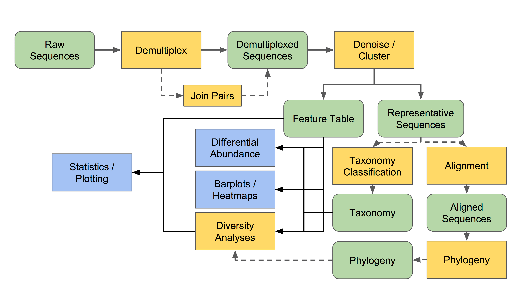

# beginning-metagenomics

This repo would serve as beginner's path for metagenomics, while myself a beginner trying to figure out the path and constantly pushing resources and pipline materials.

---

## Amplicon Sequencing

Amplicon sequencing is a method of targeted next generation sequencing (NGS) allowing researchers to analyze genetic variations in specific genomic regions using polymerase chain reaction (PCR) primers designed to amplify a region (regions) of interest in a genome. 

The 16S ribosomal rRNA gene in prokaryotes and 18S rRNA gene in eukaryotes is considered as molecular marker for distinguishing.

16S rRNA gene contains 10 highly conserved regions and 9 regions that are variable. In 16S rRNA amplicon sequencing of bacteria, the highly conserved region serves as primer while the variable regions helps in identifying bacterial taxas.

The amplified 16S rRNA gene can then be sequenced on one of numerous platforms including:

- 454-pyrosequencing  
- Illumina Hiseq and Miseq  
- Ion Torrent 

---

## QIIME2 - Amplicon Distribution

### Artifacts and visualization

All files generated by QIIME 2 are either .qza or .qzv files, and these are simply zip files that store your data alongside some QIIME 2-specific metadata.

.qza stands for qiime zipped artifcacts that has intermediary files in a analysis workflow.

.qzv stands for qiime zipped visualization which helps in providing interactive visualization. These files can be viewed in https://view.qiime2.org/

QIIME 2 artifacts are assigned exactly one artifact class, which indicates the semantics of the data (its semantic type) and the file format that is used to store it inside of the .qza file.

### Data provenance

QIIME 2 was designed to automatically document analysis workflows for users, ensuring that their bioinforamtics work is reproducible. 

To achieve this, each QIIME 2 command is recorded when it is run, and that information is stored in all Artifacts and Visualizations that are created.

One can view the data provenance in https://view.qiime2.org/ by simply uploading the .qza or .qzv file.

### Plugins 

Plugins define actions, which are the individual commands that you’ll run in an analysis workflow. 

Three types of actions can be defined by plugins: methods, visualizers, and pipelines.

- Methods: that take one or more artifact to generate artifacts.
- Visualizers: that take artifact(s) to produce .qzv file.
- Pipeline: takes artifacts, parameters as input and produces .qza and .qzv files.

---

### Conceptual Overview

---
## References

1. R. Lanza & A. Atala (Eds.), *Molecular Biology*, Academic Press, 2020. [ScienceDirect Link](https://www.sciencedirect.com/book/9780128132883/molecular-biology)  
2. Paragon Genomics. *What is Amplicon Sequencing?* [Website](https://www.paragongenomics.com/targeted-sequencing/amplicon-sequencing/#:~:text=What%20is%20Amplicon%20Sequencing?)  
3. Ellermann, M., Carr, J.S., Fodor, A.A., Arthur, J.C., & Carroll, I.M. (2019). *Characterizing and Functionally Defining the Gut Microbiota: Methodology and Implications*. In: The Gut-Brain Axis (Chapter 2). Academic Press.
4. https://amplicon-docs.qiime2.org/en/latest/explanations/getting-started.html

