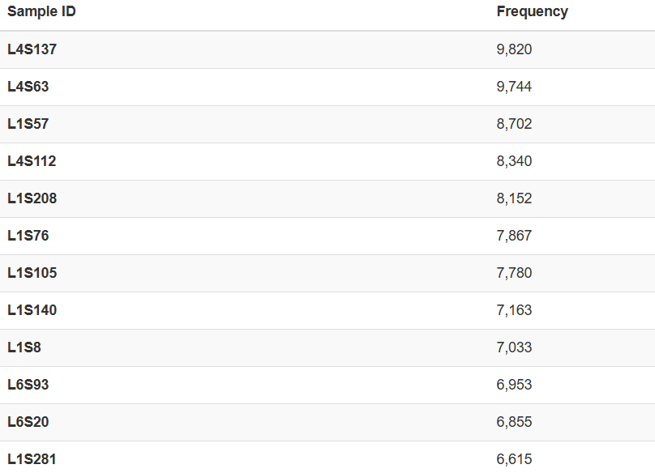

# Moving Picture Tutorial from QIIME2

## Installing latest version of QIIME2 Amplicon Distribution
```
conda env create \
  --name qiime2-amplicon-2025.7 \
  --file https://raw.githubusercontent.com/qiime2/distributions/refs/heads/dev/2025.7/amplicon/released/qiime2-amplicon-ubuntu-latest-conda.yml
```

## Data Overview 

The subset of the data published from research article Global patterns of 16S rRNA diversity at a depth of millions of sequences per sample (https://www.pnas.org/doi/10.1073/pnas.1000080107).

The hypervariable region 4 (V4) of the 16S rRNA gene was amplified using the F515-R806 primers - a broad-coverage primer pair for Bacteria that also picks up some Archaea. Single-end sequencing was performed on an Illumina HiSeq.

## Downloading the data

```
#Dowloading Metadata of the samples

wget -O 'sample-metadata.tsv' \
  'https://moving-pictures-tutorial.readthedocs.io/en/latest/data/moving-pictures/sample-metadata.tsv'

#Downloading the Sequencing reads
wget -O 'emp-single-end-sequences.zip' \
  'https://moving-pictures-tutorial.readthedocs.io/en/latest/data/moving-pictures/emp-single-end-sequences.zip'

unzip -d emp-single-end-sequences emp-single-end-sequences.zip
```
## Metadata

It is .tsv file consisting of the data related to the experiment like site of the sample, time, subject, barcode etc. The metadata can be visualised once converted to .qzv by using tabulate plugin.

```
qiime metadata tabulate \
  --m-input-file sample-metadata.tsv \
  --o-visualization sample-metadata-viz.qzv
```


From the above viusalisation in qiime2view we can see there are 34 different samples, whose collection site and other details are given. Details to be noted are -

- sample id
- barcode-sequence
- site of collection
- subject(1 or 2)
- antibiotic usage
- time of sequencing during experiment

## Importing Data to QIIME2

The data which is imported simply a fastq file converted into qiime2 artifact(.qza).

```
#install and activate qiime2 amplicon distribution
conda activate qiime2-amplicon-2024.10

#importing into qiime2
qiime tools import \
  --type 'EMPSingleEndSequences' \
  --input-path emp-single-end-sequences \
  --output-path data/emp-single-end-sequences.qza
```

## Demultiplexing

Demultiplexing requires sequences and metadata files as input. 

```
#demultiplexing
qiime demux emp-single \
  --i-seqs data/emp-single-end-sequences.qza \
  --m-barcodes-file sample-metadata.tsv \
  --m-barcodes-column barcode-sequence \
  --o-per-sample-sequences demul/demux.qza \
  --o-error-correction-details demul/demux-details.qza

#results of demultiplexing
qiime demux summarize \
  --i-data demul/demux.qza \
  --o-visualization demul/demux.qzv

#visualizing for error correction
qiime metadata tabulate \
  --m-input-file demul/demux-details.qza \
  --o-visualization demul/demux-details-viz.qzv
```
The demultiplexing has resulted in seperation of 263931 reads to its sample id(total samples=34) which can be viewed in qiim2view along with other statistics and visualisation.


## Quality Control

There are two types of plugins used - DADA2 and Deblur, inorder to read about best plugin to use go through Denoising the Denoisers: an independent evaluation of microbiome sequence error-correction approaches(https://peerj.com/articles/5364/).


Two important inputs for denoising are for either trimming the primer or low quality reads from the right or left and maintaing the length of read by truncating.

The interactive visualisation from demux results helps us to determine in maintaining the length of reads to particular base number. In this case its 120 due to more sharp dipping of quality score. And the reads from far left seems to be at highest quality so we keep at 0.

```
#denoising using DADA2
qiime dada2 denoise-single \
  --i-demultiplexed-seqs demul/demux.qza \
  --p-trim-left 0 \
  --p-trunc-len 120 \
  --o-representative-sequences dada2/rep-seqs.qza \
  --o-table dada2/table.qza \
  --o-denoising-stats dada2/stats.qz
  --verbose

#visualisation of stats
qiime metadata tabulate \
  --m-input-file stats.qza \
  --o-visualization stats.qzv

#visualisation of feature table
qiime feature-table summarize \
  --i-table dada2/table.qza \
  --m-sample-metadata-file sample-metadata.tsv \
  --o-visualization dada2/table.qzv

#visualisation of feature data
qiime feature-table tabulate-seqs \
  --i-data dada2/rep-seqs.qza \
  --o-visualization dada2/rep-seqs.qzv
```
## DADA2 summary

Significant factors in stats of DADA2 -

- input - number of sequences (refer demux.qzv)
- filtered - low quality removal
- denoised - error corrected 
- non-chimeric - real biological sequence without any duplicates created during sequencing


From feature table visualisation we can see there are 770 unique feature which occuring across 34 samples with frequency of 153,807(overall frequency).


And can see total frequency of features occuring in a sample as well as feature occuring in different samples.



## Phylogenetic Diversity Analysis

For building a phylogenetic tree (rooted and unrooted tree) and proceeding with diversity analysis, we first aligin sequence using MAFT (Multiple Alignment using Fast Fourier Transform), then denoise and build a unrooted tree by FastTree and rooted tree with Midpoint rooting.

```
qiime phylogeny align-to-tree-mafft-fasttree \
  --i-sequences dada2/rep-seqs.qza \
  --o-alignment phylo/aligned-rep-seqs.qza \
  --o-masked-alignment phylo/masked-aligned-rep-seqs.qza \
  --o-tree phylo/unrooted-tree.qza \
  --o-rooted-tree phylo/rooted-tree.qza
```